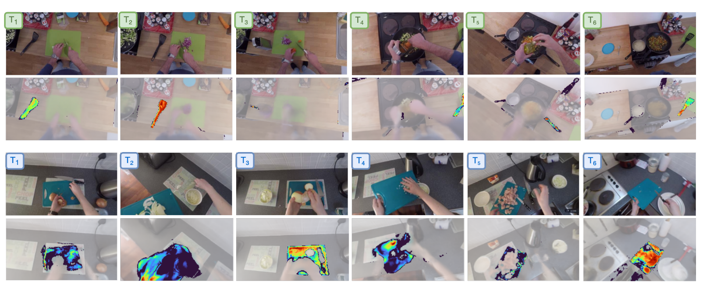
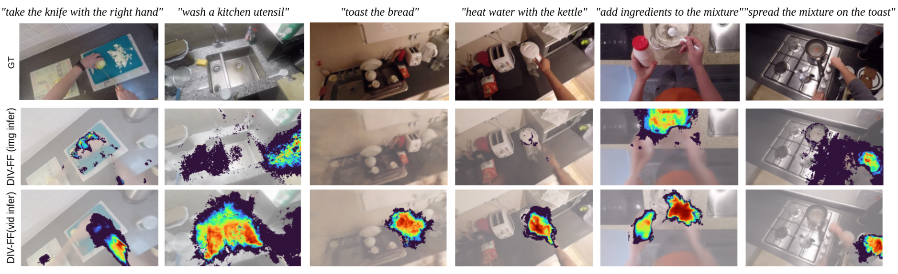

# Dynamic Image-Video Feature Fields (DIV-FF)

## ✨✨ Accepted in CVPR 2025!! ✨✨


## About
This repository contains the official implementation of the paper *Dynamic Image-Video Feature Fields (DIV-FF)* by [Lorenzo Mur-Labadia](https://sites.google.com/unizar.es/lorenzo-mur-labadia/inicio), [Josechu Guerrero](http://webdiis.unizar.es/~jguerrer/), [Ruben Martinez-Cantin](https://webdiis.unizar.es/~rmcantin/), Published at CVPR 2025. 

💻💻[Official webpage](https://lmur98.github.io/DIV_FF_webpage/)💻💻    📃📃 [Paper](https://arxiv.org/pdf/2503.08344)📃📃

Environment understanding in egocentric videos is an important step for applications like robotics, augmented reality and assistive technologies. These videos are characterized by dynamic interactions and a strong dependence on the wearer engagement with the environment. Traditional approaches often focus on isolated clips or fail to integrate rich semantic and geometric information, limiting scene comprehension. We introduce Dynamic Image-Video Feature Fields (DIV-FF), a framework that decomposes the egocentric scene into persistent, dynamic, and actor-based components while integrating both image and video-language features. Our model enables detailed segmentation, captures affordances, understands the surroundings and maintains consistent understanding over time. DIV-FF outperforms state-of-the-art methods, particularly in dynamically evolving scenarios, demonstrating its potential to advance long-term, spatio-temporal scene understanding.

## Dataset

Download EPIC-Diff from the [original repository](https://www.robots.ox.ac.uk/~vadim/neuraldiff/release/EPIC-Diff-annotations.tar.gz). 
After downloading, move the compressed dataset to the directory of the cloned repository (e.g. NeuralDiff). Then, apply following commands:
```bash
mkdir data
mv EPIC-Diff.tar.gz data
cd data
tar -xzvf EPIC-Diff.tar.gz
```

The RGB frames are hosted separately as a subset from the [EPIC-Kitchens](https://epic-kitchens.github.io/2022) dataset. The data are available at the University of Bristol [data_repository](https://doi.org/10.5523/bris.296c4vv03j7lb2ejq3874ej3vm), data.bris. Once downloaded, move the folders into the same directory as mentioned before (data/EPIC-Diff).

## Pre-trained models

We provide checkpoints with the geometry only or geometry plus distilled semantics. You can train your own implementation from the geometry or perform inference from our distilled semantics.
- Geometric models ([NeuralDiff weights](https://www.robots.ox.ac.uk/~vadim/neuraldiff/release/ckpts.tar.gz))
- Geometry plus distilled Clip and EgoVideo ([DIV-FF Weights](https://drive.google.com/drive/folders/1ZEmAE6Zz6mL2J6BtWwwZuFGFHAg8WnnX?usp=drive_link))

## Visualize predictions
For instance, to evaluate the scene with Video ID `P01_01`, use the following command:
```
sh scripts/eval.sh rel P01_01 rel 'masks' 0 0
```
The las two arguments represent the number of frames to use in the evaluation. 0 means that we use every frame. The results are saved in `results/rel`.
You can modify in the sh the desired text queries to obtain the relevancy maps. 

**Important!!** When the flag --video_active is True, the relevancy maps are obtained from the distilled EgoVideo feats. Otherwise, the CLIP features are used.

**Important!!** Add in eval.sh the arg --positive_queries with the queries you want to render (e.g. --positive_queries "human arms","cooking")


## Full scene metrics
This just evaluates the semantic performance on the test images (a 10% of the total images per scene)
Running the following command, you can obtain the scene metrics for the dynamic object segmentation (with CLIP features) or the affordance segmentation (EgoVideo features).
```
sh scripts/eval.sh rel P01_01 rel 'object_segmentation' 0 0
sh scripts/eval.sh rel P01_01 rel 'action_segmentation' 0 0
```

Dynamic Object Segmentation


Affordance Segmentation


Or if desired, you want to use the paper OWL or OOAL baselines results, just run:
```
sh scripts/eval.sh rel P01_01 rel 'open_voc' 0 0
sh scripts/eval.sh rel P01_01 rel 'predict_OOL_AFF' 0 0
```
## Full video rendering
This visualizes the rendering of all the images (train and test) per sequence. You can select a fixed viewpoint, too.
```
sh scripts/eval.sh rel P01_01 rel 'clip_video' 0 0
```
If you just want to visualize the geometry, run:
```
sh scripts/eval.sh rel P01_01 rel 'summary' 0 0
```

This will result in a corresponding video in the folder `results/rel/P01_01/summary`. The fixed viewpoints are pre-defined and correspond to the ones that we used in the videos provided in the supplementary material. You can adjust the viewpoints in `__init__.py` of `dataset`.


## Training

You can train from the beggining the geometry part (NeuralDiff), without CLIP/DINO with the following command
```
sh scripts/train.sh P01_01
```
Then, you can resume the training by adding --ckpt_path ckpts/rel/$VID\/epoch=2.ckpt
Once geometry is obtained, you can distill the semantics with 
```
sh scripts/train_clip.sh P01_01
```
and you have to indicate with --ckpt_path_pretrained the geometry version to start training.
We recomend this 2 stage training for convergence. You can also train from scratch the geometry+semantics, but the results are worse.

## Contact
If you have further questions, please contact me [personal email](lmur@unizar.es)

## Cite
Please, if you are interested, cite our work as follows:
```
@article{mur2025div,
  title={DIV-FF: Dynamic Image-Video Feature Fields For Environment Understanding in Egocentric Videos},
  author={Mur-Labadia, Lorenzo and Guerrero, Josechu and Martinez-Cantin, Ruben},
  journal={arXiv preprint arXiv:2503.08344},
  year={2025}
}
```

## Acknowledgements
We highly appreciate the work from Tschernezki et al.
```
@inproceedings{tschernezki21neuraldiff,
  author     = {Vadim Tschernezki and Diane Larlus and
                Andrea Vedaldi},
  booktitle  = {Proceedings of the International Conference
                on {3D} Vision (3DV)},
  title      = {{NeuralDiff}: Segmenting {3D} objects that
                move in egocentric videos},
  year       = {2021}
}
```
